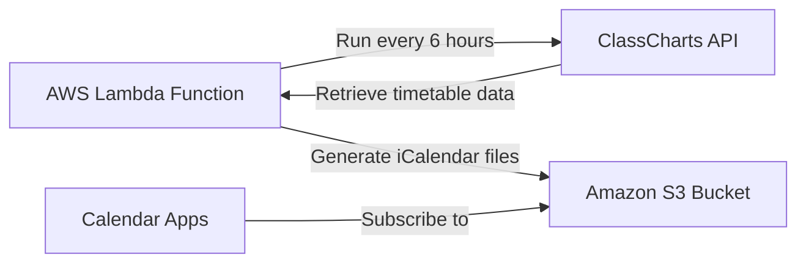

# ClassCharts Calendar Sync

[](https://github.com/phillprice/classcharts-calendar-ics/actions)
[](https://phillprice.github.io/classcharts-calendar-ics/)

A serverless application that automatically syncs ClassCharts timetable data to iCalendar files, making school schedules easily accessible across all calendar applications. The system fetches data from ClassCharts and generates calendar files that are hosted on Amazon S3, allowing seamless subscription from Apple Calendar, Google Calendar, Outlook, and other calendar applications.

## Features

- **Automatic Syncing**: Updates calendars every 6 hours to keep timetables current
- **Multi-Student Support**: Manage calendars for multiple students from a single account
- **Secure Credential Storage**: Uses AWS Secrets Manager for secure credential management
- **Universal Calendar Access**: Compatible with any calendar app that supports iCal subscription
- **Local Testing**: Test functionality without AWS credentials using local mode
- **Easy Deployment**: Simple deployment with AWS SAM (Serverless Application Model)

## Documentation

Comprehensive documentation is available at our [documentation site](https://phillprice.github.io/classcharts-calendar-ics/):

- [Getting Started](https://phillprice.github.io/classcharts-calendar-ics/getting-started/) - Quick setup guide
- [Configuration](https://phillprice.github.io/classcharts-calendar-ics/configuration/) - Configure environment variables and AWS resources
- [Deployment](https://phillprice.github.io/classcharts-calendar-ics/deployment/) - Deploy the application to AWS
- [Development](https://phillprice.github.io/classcharts-calendar-ics/development/environment-setup/) - Local development instructions
- [Calendar Usage](https://phillprice.github.io/classcharts-calendar-ics/usage/calendar-access/) - Access and use the generated calendars
- [Project Information](https://phillprice.github.io/classcharts-calendar-ics/project/structure/) - Project structure and contribution guidelines

## Architecture Overview

The ClassCharts Calendar Sync application uses AWS Lambda to periodically fetch data from the ClassCharts API and generate iCalendar files that are stored in Amazon S3. The generated calendar files are then available via public URLs that can be subscribed to from any calendar application.



## Quick Start

```bash
# Clone the repository
git clone https://github.com/phillprice/classcharts-calendar-ics.git
cd classcharts-calendar-ics

# Install dependencies
pip install -r requirements.txt

# Build the SAM application
sam build

# Deploy with guided setup
sam deploy --guided
```

For detailed setup and configuration instructions, see the [documentation site](https://phillprice.github.io/classcharts-calendar-ics/).


## License

This project is licensed under the MIT License - see the [LICENSE](LICENSE) file for details.


## Contributing

Contributions are welcome! Please check the [contribution guidelines](https://phillprice.github.io/classcharts-calendar-ics/project/contributing/) for more information.

## Acknowledgments

- [ClassCharts](https://www.classcharts.com/) for providing the student timetable data
- [AWS SAM](https://aws.amazon.com/serverless/sam/) for the serverless application framework
- [ics.py](https://github.com/ics-py/ics-py) for iCalendar generation
